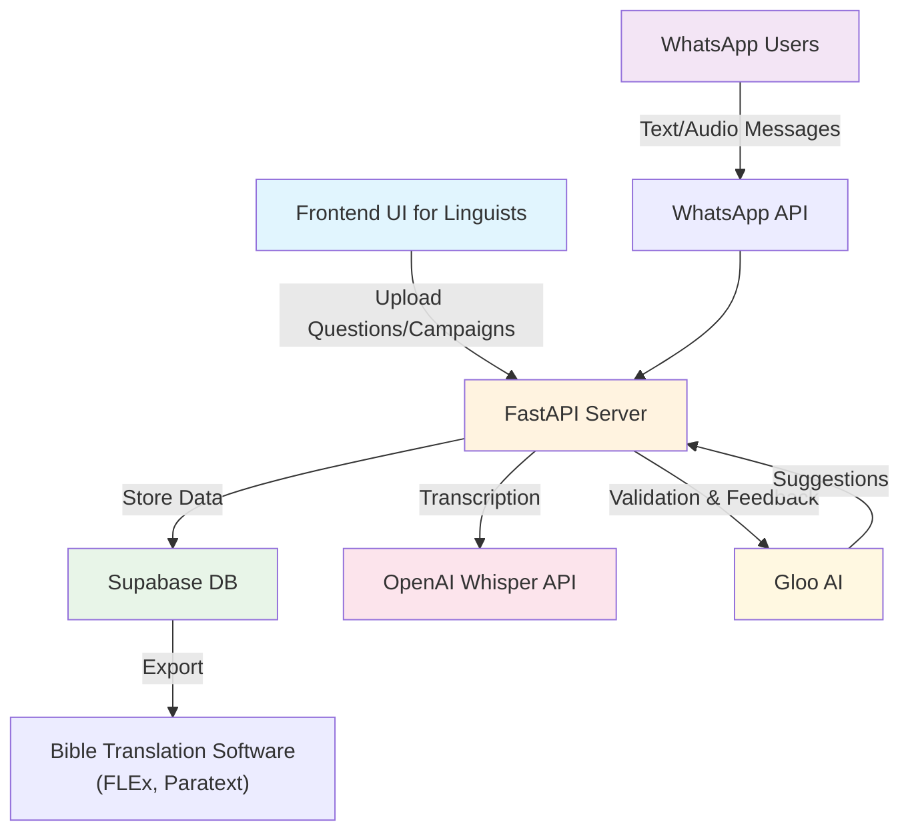
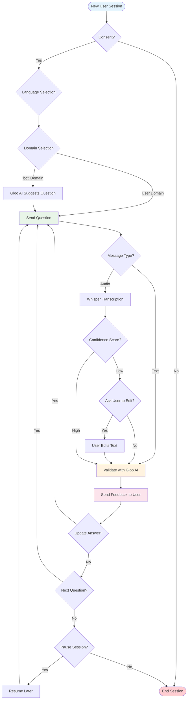

# Bible translation WhatsApp chatbot

Thanks to Joel Matthew's great [blog article](https://www.etenlab.org/post/bible-translation-and-whatsapp) at the ETEN Lab, we have decided to build WhatsApp bot to collect more structured and cleaned data from speakers of low-resource languages.

> ... in an extremely resource-strapped or sensitive region, a WhatsApp AI-bot could be **the** application for doing Bible Translation. More people own smartphones than computers and I know places that have differential pricing for Meta (formerly Facebook) services. 

WhatsApp, as a widely used communication tool lowers the barrier for people to contribute to bible translation. WhatsApp natively supports multiple formats of messages: text, image, video, document, audio etc. This bot aims to address text and voice messages as a start.

## Design
A server that takes input from linguists with a frontend UI, and handles WhatsApp chat sessions from end-users who answer those questions. Bible translators can set up question campaigns to elicit information on certain topics to speakers of targeted languages.



### AI's role
1. Handle transcription of audio messages from the users. (OpenAI's Whisper API)
2. Validation of users' answers and user-edited transcriptions; it also gives knowledge-rich information on the question and response. (Gloo AI)
3. Suggestion of new questions for low-coverage languages for which linguists have not uploaded enough questions. (Gloo AI)

## Implementation
The FastAPI server app has been deployed to render.com through Docker environment. We use remote Supabase for storage.

### The conversation flow
For each new user session, we collect consent and the user-chosen language first, then the user picks a domain of questions. (A special domain of 'bot' is for AI-suggested questions.) 
Upon receiving an audio message, the Whisper API calculates the confidence score of the transcription, and asks the user to accept or edit the text if needed. This processed text or the original text in text-format messages will go through validation by Gloo. The user also gets to update their answer after being given more information in the feedback.
A session can be paused after the completion of any question, and will be picked back up later.



An example question from Gloo:
> What specific biblical terms or phrases in your [language] dialect are most challenging to translate accurately, and what culturally resonant alternatives would you suggest to convey their meaning faithfully?

#### Technical walkthrough
- A SessionManager that keeps track of users' transitional states and progress
- MessageHandlers routes different states to corresponding handlers (domains, questions, consent)

### Screenshots

#### Try it out
If you'd like to test out the code yourself: 
```
# Local development
pip3 install -r requirements.txt
python3 -m uvicorn poc_app:fastapi_app --reload --port LOCAL_PORT

# Docker
docker compose up --build
```
Basically what's needed in the environment vars are
```
OPENAI_API_KEY # for transcription

GLOO_CLIENT_ID
GLOO_CLIENT_SECRET

SUPABASE_URL
SUPABASE_ANON_KEY

WHATSAPP_PHONE_ID
WHATSAPP_TOKEN
WHATSAPP_VERIFY_TOKEN
WHATSAPP_CALLBACK_URL
WHATSAPP_APP_ID
WHATSAPP_APP_SECRET
```

## Advantages
- We designed this with linguists' needs in mind in the first place &mdash; exported data from bible translation software from FLEx, Paratext can be easily imported.
- Our app gives real-time feedback to the users after every response, so that it's an engaging and interactive conversation.

## Future work
(Ideas from Joel's post)
- Crowdsourced internal cross-validation and feedback (with user consent).
- "Cold-start" a seed dataset to further produce AI drafts for the human translators to leverage. (Currently, this process is bottlenecked by not having enough of the participants on the same application platform.)


