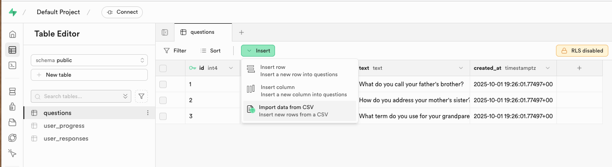

<!-- _class: title -->
__Bible translation challenge__
&nbsp;

# Empowering Bible translation with crowdsourced data
## &mdash; A WhatsApp chatbot to collect user input for low-resource languages

&nbsp;

by Joshua & Siwei
Oct 9, 2025

***
<!-- paginate: true -->

# __Linguists' wish:__ as many datapoints as possible

***
# Upload data

***
# __Gloo AI__ for recommendation and cleaning